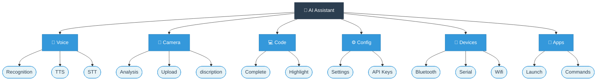
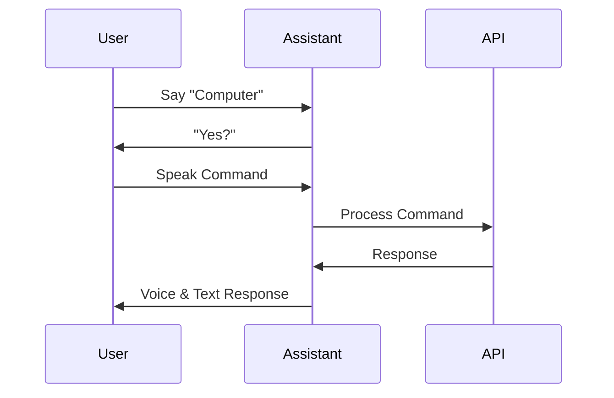

# 🤖 AI Assistant

<div align="center">


[](https://www.riverbankcomputing.com/software/pyqt/)
[](https://console.picovoice.ai/)
[](https://aistudio.google.com/apikey)

A modern AI assistant featuring voice control, voice interaction, camera analysis, code generation, and device management.
Built with Python and PyQt6, providing a seamless and intuitive interface for AI-powered tasks.

</div>

## 🎥 Live Demo

<div align="center">
  <p><strong>AI Assistant in Action</strong></p>
  <div style="width: 600px; margin: 0 auto; overflow: hidden; border-radius: 10px; box-shadow: 0 4px 8px rgba(0,0,0,0.1);">
    
  </div>
  <p><em>Experience the seamless interaction with voice commands, real-time responses, and intelligent assistance.</em></p>
</div>

### ✨ Key Features Demonstrated:
- 🎤 **Voice Interaction**: Natural conversation with wake word activation
- 🤖 **AI Processing**: Real-time responses powered by Gemini AI
- 💻 **Smart Interface**: Clean, modern UI with intuitive controls
- ⚡ **Quick Actions**: Efficient command processing and execution

## 🌟 Quick Preview

<div align="center">
<table style="border-spacing: 15px; border-collapse: separate;">
  <tr>
    <td align="center" style="background: white; border-radius: 10px; box-shadow: 0 2px 4px rgba(0,0,0,0.1); padding: 15px;">
      <strong>Voice Commands</strong><br/>
      <div style="width: 300px; overflow: hidden; border-radius: 8px; margin: 10px 0;">
        
      </div>
      <em>Wake word activation and voice response</em>
    </td>
    <td align="center" style="background: white; border-radius: 10px; box-shadow: 0 2px 4px rgba(0,0,0,0.1); padding: 15px;">
      <strong>AI Processing</strong><br/>
      <div style="width: 300px; overflow: hidden; border-radius: 8px; margin: 10px 0;">
        
      </div>
      <em>Real-time AI-powered interactions</em>
    </td>
  </tr>
</table>
</div>

## 🌟 Features Overview



### Key Features

| Category | Features |
|----------|----------|
| 🎤 **Voice** | Wake word detection, Speech recognition, Text-to-speech, Noise reduction |
| 📸 **Camera** | Real-time analysis, Image upload, Custom prompts, Gemini Vision |
| 💻 **Code** | Smart completion, Syntax highlighting, Editor integration |
| ⚙️ **Config** | API setup, Voice settings, UI preferences, Storage |
| 📱 **Devices** | Bluetooth control, Port detection, Serial communication |
| 🔗 **Apps** | Custom commands, App launching, Command sequences |

### 🎤 Voice Control
- **Wake Word Detection**: Activate with "computer" using Picovoice Porcupine
- **Speech Recognition**: Accurate voice-to-text with noise reduction
- **Text-to-Speech**: Natural voice responses with multiple voice options
- **Noise Reduction**: WebRTC-based voice activity detection

### 📸 Camera Features
- **Real-time Analysis**: Live camera feed processing
- **Image Upload**: Support for image file analysis
- **Custom Prompts**: Tailored image analysis queries
- **Gemini Vision**: Powered by Google's Gemini AI for image understanding

### 💻 Code Generation
- **Smart Completion**: Context-aware code suggestions
- **Syntax Highlighting**: Clear code visualization
- **Editor Integration**: Custom editor configuration
- **Code Simulation**: Typing simulation for demonstrations

### ⚙️ Settings Management
- **API Configuration**: Gemini and Picovoice API key management
- **Voice Settings**: Language and voice customization
- **UI Preferences**: Theme and display options
- **Persistent Storage**: Settings auto-save and recovery

### 📱 Device Management
- **Bluetooth Control**: Serial communication with devices
- **Device Discovery**: Automatic port detection
- **Connection Management**: Connect/disconnect functionality
- **Custom Commands**: Device-specific command handling

### 🔗 App Integration
- **Custom Commands**: User-defined command sequences
- **App Launching**: Quick access to favorite applications
- **Command Sequences**: Multi-step automation
- **Settings Persistence**: Saved configurations across sessions

## 🔑 Quick API Setup

<table>
<tr>
  <td>
    <b>🗣️ Wake Word (Picovoice)</b><br/>
    <a href="https://console.picovoice.ai/">Get Key →</a><br/>
    <small>Free: Default wake words & basic usage</small>
  </td>
  <td>
    <b>🧠 AI Features (Gemini)</b><br/>
    <a href="https://aistudio.google.com/apikey">Get Key →</a><br/>
    <small>Free: Gemini Pro with generous limits</small>
  </td>
</tr>
</table>

Add keys to `.env`:
```env
PICOVOICE_API_KEY=xxxxx
GEMINI_API_KEY=xxxxx
```

## 🚀 Quick Start

### Prerequisites
- Python 3.8 or higher
- pip (Python package installer)
- Microphone (for voice features)
- Camera (for image analysis)

### Installation

1. Clone the repository:
```bash
git clone https://github.com/moego0/ai-assistant.git
cd ai-assistant
```

2. Create and activate virtual environment:
```bash
# Windows
python -m venv venv
venv\Scripts\activate

# Linux/Mac
python3 -m venv venv
source venv/bin/activate
```

3. Install dependencies:
```bash
pip install -r requirements.txt
```

4. Configure API Keys:
   - Launch the application
   - Navigate to Settings
   - Add required API keys:
     - Gemini API key (AI features)
     - Porcupine key (wake word)

## 🎯 Usage Guide

### Voice Interaction Flow



### 🎤 Voice Commands
- Activate: Say "computer"
- Speak your command/question
- Receive voice and text response

### 📸 Image Analysis
1. Access camera via camera icon
2. Options:
   - Real-time analysis
   - Image upload
   - Custom analysis prompts

### 💻 Code Generation
1. Describe your code needs
2. Get formatted, syntax-highlighted code
3. Copy or save generated code

## ⚙️ Configuration

### Settings Panel
| Category | Options |
|----------|---------|
| Voice | Gender (Male/Female) |
| Language | English/Arabic/Bilingual |
| API Keys | Gemini, Porcupine |
| Model | Multiple Gemini models |

### Default Configuration
```json
{
    "voice_gender": "male",
    "speech_language": "en-US",
    "vad_aggressiveness": 3
}
```

## 🛠️ Development

### Requirements
Check `requirements.txt` for full dependency list:
- PyQt6 >= 6.4.2
- google-generativeai >= 0.3.0
- SpeechRecognition >= 3.10.0
- And more...

### Project Structure
```
ai-assistant/
├── AI_Assistant.py    # Main application
├── requirements.txt   # Dependencies
├── README.md         # Documentation
├── LICENSE          # MIT License
└── .gitignore       # Git ignore rules
```

## 🤝 Contributing

Contributions welcome! Please:
1. Fork the repository
2. Create feature branch
3. Commit changes
4. Push to branch
5. Open pull request

## 📄 License

This project is licensed under the MIT License - see [LICENSE](LICENSE) file.

## 🙏 Acknowledgments

- Google Gemini - AI capabilities
- PyQt6 - UI framework
- Picovoice - Wake word detection
- Open source community

## 🏠 Device Control

### Supported Devices
- Smart Lights (Philips Hue, LIFX, etc.)
- Smart Thermostats (Nest, Ecobee)
- Security Cameras
- Media Players (Smart TVs, Speakers)
- Smart Plugs and Switches

### Setup Process
1. Enable device discovery in Settings
2. Connect to your home network
3. Authorize devices
4. Create device groups (optional)

## 🤖 Automation

### Features
- Custom Script Creation
- Scheduled Tasks
- Event-Based Triggers
- App Integration
- Voice Command Macros

### Example Automation
```python
# Morning Routine Automation
@automation.schedule("07:00")
def morning_routine():
    # Turn on lights gradually
    smart_lights.fade_in(duration=300)
    # Set temperature
    thermostat.set_temperature(22)
    # Start coffee maker
    smart_plug.turn_on("coffee_maker")
```

## 📥 Installation Guide

### Prerequisites
- Python 3.8 or higher
- Git
- Microphone (for voice features)
- Camera (optional, for image analysis)

### Step 1: Clone the Repository
```bash
git clone https://github.com/moego0/ai-assistant.git
cd ai-assistant
```

### Step 2: Set Up Virtual Environment
```bash
# Windows
python -m venv venv
venv\Scripts\activate

# Linux/macOS
python3 -m venv venv
source venv/bin/activate
```

### Step 3: Install Dependencies
```bash
pip install -r requirements.txt
```

### Step 4: Get API Keys
1. **Picovoice (Wake Word Detection)**
   - Visit [Picovoice Console](https://console.picovoice.ai/)
   - Create a free account
   - Get your API key
   - Free tier includes:
     * Default wake words
     * Basic usage limits

2. **Google Gemini (AI Features)**
   - Visit [Google AI Studio](https://aistudio.google.com/apikey)
   - Sign in with your Google account
   - Get your API key
   - Free tier includes:
     * Access to Gemini Pro
     * Generous usage limits

### Step 5: Configuration
1. Create a `.env` file in the project root:
```env
PICOVOICE_API_KEY=your_picovoice_key_here
GEMINI_API_KEY=your_gemini_key_here
```

2. (Optional) Customize settings in `editor_config.json`

## 🚀 Usage

### Starting the Assistant
```bash
python AI_Assistant.py
```

### Voice Commands
- Say "computer" to activate
- Wait for the activation sound
- Speak your command
- Examples:
  * "What's the weather like?"
  * "Generate some Python code"
  * "Analyze this image"

### Camera Features
- Click the camera icon to start
- Use "Analyze" for real-time analysis
- Upload images for detailed analysis

### Code Generation
- Request code in natural language
- Use the code editor for modifications
- Save generated code to files

## 🤝 Contributing

1. Fork the repository
2. Create your feature branch:
```bash
git checkout -b feature/AmazingFeature
```
3. Commit your changes:
```bash
git commit -m 'Add some AmazingFeature'
```
4. Push to the branch:
```bash
git push origin feature/AmazingFeature
```
5. Open a Pull Request

## 🐛 Troubleshooting

### Common Issues
1. **Microphone not working**
   - Check microphone permissions
   - Select correct input device in settings

2. **Camera issues**
   - Ensure camera permissions are granted
   - Check camera connection

3. **API Key errors**
   - Get a valid API key from Picovoice and Gemini AI
   - Check API key format
   - Ensure free tier limits not exceeded

### Getting Help
- Open an issue on GitHub
- Check existing issues
- Include error messages and system info

## 🎯 How to Use

### Wake Word
To activate the assistant, simply say: **"Computer"**

### Available Commands

| Command | Description | Example |
|---------|-------------|---------|
| `Open [application]` | Launch applications | "Open Chrome", "Open Spotify" |
| `Search for [query]` | Search the web | "Search for gold preices today" |
| `What's the time?` | Get current time/date | "What's the time?" |
| `Type [text]` | Type text via voice | "Type Hello World" |
| `Genrate code` | Genrate code  | "genrate code for python calculator" |
| `control devices` | Open and close lights | "open red light" |


### Command Tips
- Speak clearly and at a normal pace
- Wait for the wake word acknowledgment before giving a command
- Commands are case-insensitive
- For application names, use common names (e.g., "chrome" instead of "google chrome")
- Don't forget to initialize apps and devices before using them
- Use the `Genrate code` command to generate code
- Use the `control devices` command to open and close lights
- Use the `Open [application]` command to launch applications
- You can integrate this app with Arduino or Home assistant to control you hame and devices


---
<div align="center">
Made with ❤️ by Mohamed Abdelraouf
</div> 
